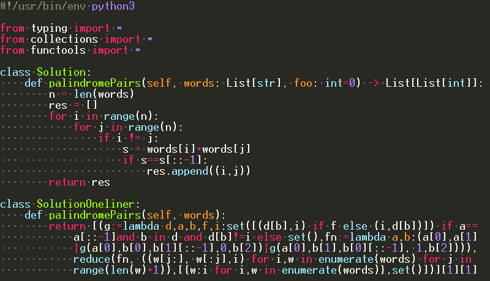

# Monokai

Monokai-like Far Manager color schemes



## Disclaimer

This is not just a color scheme, it's also syntax rules.
Default language syntax rules do not fully support Monokai color definitions.
There's no much sense in using just the color scheme (`monokai.hrd`) without custom rules (`monokai.hrc`),
it won't work as intended. Also you can't switch them off in settings so you'd have to use Monokai everywhere.

## Installation

### HRC

```
copy *.hrc %FARHOME%\Plugins\FarColorer\base\auto\
```

### HRD

```
copy *.hrd %FARHOME%\Plugins\FarColorer\base
copy *.xml %FARHOME%\Plugins\FarColorer\base

```

* Open editor file, press F11, select Far Colorer, Configure, Main settings
* Set "Users file of color styles" to `%FARHOME%\Plugins\FarColorer\base\catalog-user.xml`
* Select "Monokai" in schemes.

Reload colorer: open text editor, then F11 - Far Colorer - Reload (or restart Far).

### Color settings

You can use monokai colors both in a console and in an RGB (TrueMod) mode. Default 16-color is recommended.

* First, use `Far.exe /import far-colors.farconfig` to import color settings for the Far interface ("DN-like" colors).
* Recommended (Conemu): copy/paste color section (RGB values) from `misc/conemu-colors.xml` to `conemu.xml`.


* Alternatively (windows shortcut): Adjust RGB values in the application shortcut (but I'd rather use [Conemu](https://conemu.github.io/)).


* Alternatively, use Monokai-RGB TrueMod (conemu only). Use `misc/conemu_to_rgb.py` to rebuild RGB scheme.

## Whitespace

Note that whitespace color is buggy in the stock colorer in the RGB mode,
it uses inverted (RGB->BGR) `def:Text` colors. You may download patched colorer
with `def:Whitespace` support in the [releases](https://github.com/joric/colorer-schemes/releases) section.
My schemes already support this feature.
You don't really need it though, default whitespace color in 16-color mode looks fine.

## Supported syntax

* Python, C/C++, HTML, Proto, GLSL/HLSL (script tags also), JSON, Go, JavaScript, Markdown (fenced code blocks).

Default text is light grey to support stock colorer whitespace color and be readable.
It kind of supports all Colorer languages but you'd have to add a lot of extra rules to match the original Monokai.
Pull requests are welcome. 
